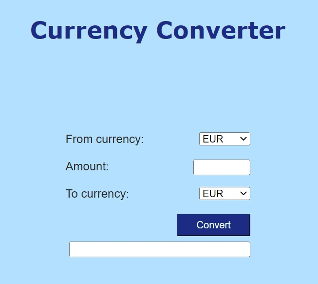

# Currency converter

Web application that enables currencies conversion.

## 1. Overview

## 2. Installation

To run the project use the following steps:

a. Clone the repo:
`git clone https://github.com/rafal-mokrzycki/currency-up-to-date-web-converter.git`

b. Create and activate virtual envirionment:
`python -m venv .venv`
`.venv\Scripts\activate.bat`

c. Install required libraries:
`pip install -r requirements.txt`

d. Run the app.py file:
`"path/to/python.exe" app.py`

e. Go to the browser and browse http://127.0.0.1:5000/. Enjoy!
